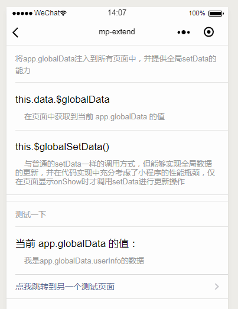

## 小程序全局状态管理，在页面中获取globalData和使用globalSetData ##

> **GitHub**: [https://github.com/WozHuang/mp-extend](https://github.com/WozHuang/mp-extend)

### 主要目标 ###

微信小程序官方没有提供类似vuex、redux全局状态管理的解决方案，但是在一个完整的项目中各组件的数据一致性是必须要保证，因此需要开发一个能够实现小程序全局状态管理的解决方案。

### 设计思路 ###

参考[omix](https://github.com/Tencent/omi/tree/master/packages/omix)后，我觉得其中实现全局状态管理的方式与小程序本身的写法有点差异

1. 小程序使用setData，omix直接使用封装的this.store修改
2. 小程序官方的示例中以app.globalData作为全局属性，omix中使用自己定义的一个store对象

相对来说omix对代码有一点入侵，我更倾向于使用官方的代码实现，但是微信并没有提供全局setData的能力，只能自己实现一个了。

### 源码实现 ###

[globalData源码](https://github.com/WozHuang/mp-extend/blob/master/demo/mp-extend/complex/extend-globalData.js)依赖于[mp-extend](https://github.com/WozHuang/mp-extend)提供的全局混入能力。

**核心内容：**

1. 在App.onLaunch 时保存 **app.globalData**

2. 在Page.onLoad 时使用 setData 将 **app.globalData** 保存到页面中，以便可以用 `this.data.$globalData` 的方式取到当前 **app.globalData** 的值（页面中以`{{$globalData}}` 的方式取值），避免手动 setData 的麻烦

3. 对所有Page对象添加方法 **$globalSetData**，实现全局setData的能力，自动修改所有页面中的data.$globalData

注：根据小程序官方文档中的描述，不应当对非显示的页面进行setData，因此在代码实现中对非显示的页面并不直接进行setData操作，而是暂存在一个数组中，等到页面显示时在onShow阶段setData（在回到上一层页面时显示的数据可能会有延迟，因此这个setData的时机可以根据需求决定，对于简单的项目直接对所有页面setData即可）

### 最终结果 ###

1. 页面中 `this.data.$globalData` 可以取到 app.globalData 的值

2. 页面中 `this.$globalSetData` 修改 app.globalData 的值并自动更新所有页面的 `$globalData`

> 参考资料
> [omi](https://github.com/Tencent/omi)

如果觉得有用可以去[GitHub](https://github.com/WozHuang/mp-extend)给我一个小星星（满脸期待.jpg）